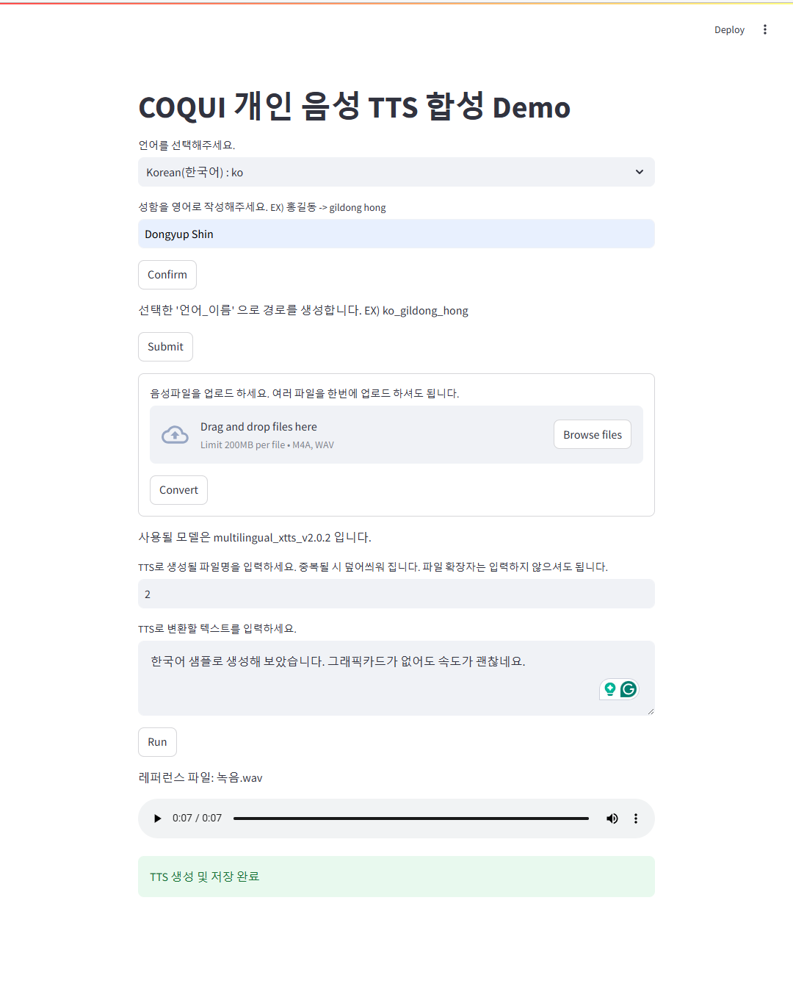

# Coqui_Xtts_Streamlit_Demo

This is a simple tutorial for Coqui XTTS using Streamlit.

```console
# miniconda run
conda create -n coqui python=3.10
conda activate coqui

# according to requirements.txt
pip install streamlit==1.38.0 tts==0.22.0 pydub==0.25.1 ipykernel==6.29.5
conda install ffmpeg==6.1.1
```

```python
# download xtts_v2.0.2 (not v2.0.3 if you mainly utilize the model for non-English speech)
from TTS.api import TTS
TTS("xtts_v2.0.2", gpu=False)

# move it to your working directory
!mv {...}/tts_models--multilingual--multi-dataset--xtts_v2.0.2/* {your_directory}/tts_models--multilingual--multi-dataset--xtts_v2.0.2/
```

Run ```streamlit run demo.py```

##### Reference
- https://github.com/coqui-ai/TTS
- https://huggingface.co/spaces/coqui/xtts/blob/main/app.py

Sample Screenshot

